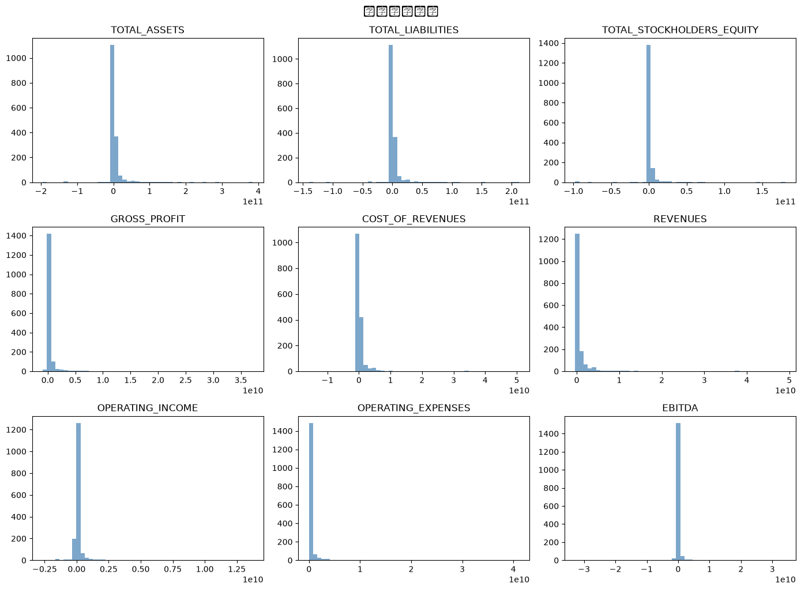
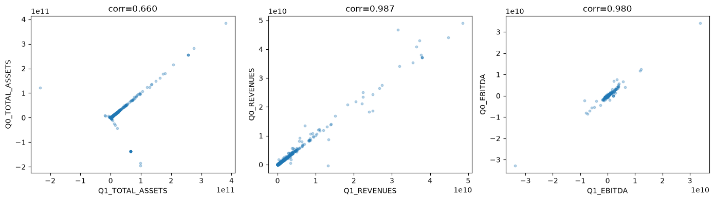
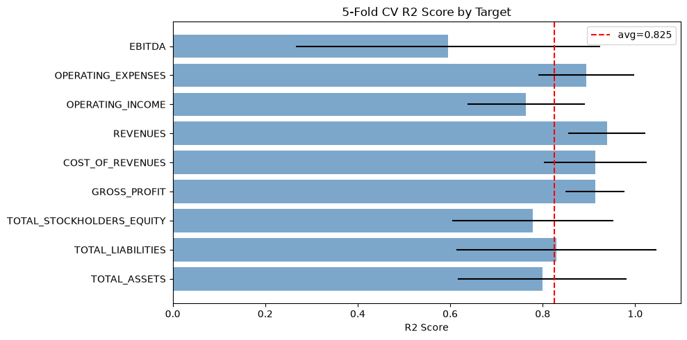
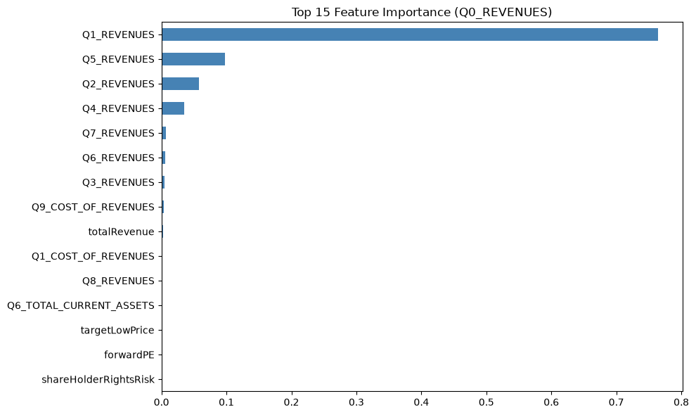

# Financial Performance Prediction 分析报告

## 一、任务概述

本项目的目标是预测2030家上市公司最近一个季度(Q0)的9个财务指标。数据来自SEC EDGAR数据库，包含连续11个季度的财务数据(Q0-Q10)和公司元信息。

评估指标为9个目标的R2 Score均值。

## 二、数据探索

### 数据规模
- 训练集: 1624家公司, 212列
- 测试集: 406家公司, 203列
- 特征: 201维（去掉Id和目标列后）

### 特征分析
- 类别特征4个: industry(113类), sector(10类), recommendationKey(6类), financialCurrency(2类)
- 数值特征包括各季度(Q1-Q10)的17个财务指标 + 公司基本面数据(PE、EPS、risk等)

### 目标变量分布

9个目标变量均呈现右偏分布，数值范围跨度很大（从负值到千亿级别），反映了不同规模公司之间的巨大差异。

### 关键发现：Q1与Q0的强相关性

Q1同名指标与Q0目标之间有极强的相关性(>0.95)。这符合直觉——公司财务状况具有很强的延续性，上一季度的数据是预测下一季度最有力的信号。

## 三、数据预处理

1. 类别特征: LabelEncoder编码
2. 缺失值: 中位数填充
3. 异常值: 替换inf为nan后统一填充
4. 列对齐: 确保训练集和测试集特征一致

## 四、模型训练

### 方法
对9个目标分别训练Gradient Boosting Regressor:
- n_estimators: 300
- max_depth: 4
- learning_rate: 0.05
- subsample: 0.8

### 交叉验证结果 (5-Fold CV R2)

| 目标 | CV R2 | 标准差 |
|------|-------|--------|
| TOTAL_ASSETS | 0.7992 | 0.1826 |
| TOTAL_LIABILITIES | 0.8297 | 0.2166 |
| TOTAL_STOCKHOLDERS_EQUITY | 0.7792 | 0.1741 |
| GROSS_PROFIT | 0.9133 | 0.0639 |
| COST_OF_REVENUES | 0.9138 | 0.1108 |
| REVENUES | 0.9389 | 0.0836 |
| OPERATING_INCOME | 0.7641 | 0.1267 |
| OPERATING_EXPENSES | 0.8942 | 0.1040 |
| EBITDA | 0.5956 | 0.3293 |

**平均CV R2: 0.8253**

### 分析
- 收入类指标(REVENUES, COST_OF_REVENUES, GROSS_PROFIT)预测效果最好(R2>0.9)，因为企业收入结构稳定
- EBITDA预测效果相对较差，可能因为涉及折旧摊销等非经常性项目波动较大
- 资产负债类指标表现中等

### 特征重要性

以REVENUES为例，最重要的特征为Q1_REVENUES(上季度收入)，其次是Q2_REVENUES等历史同名指标。这印证了时序延续性是主要预测信号。

## 五、结果与改进方向

### 当前结果
生成了submission.csv，包含406家公司9个目标的预测值。

### 可能的改进
1. 时间序列方法: 对每家公司单独建立ARIMA/Prophet模型
2. 模型融合: Stacking (GBDT + Ridge + LightGBM)
3. 外部数据: 加入宏观经济指标(GDP、利率、行业景气度)
4. 目标变换: 对目标取log可能改善极端值的预测
