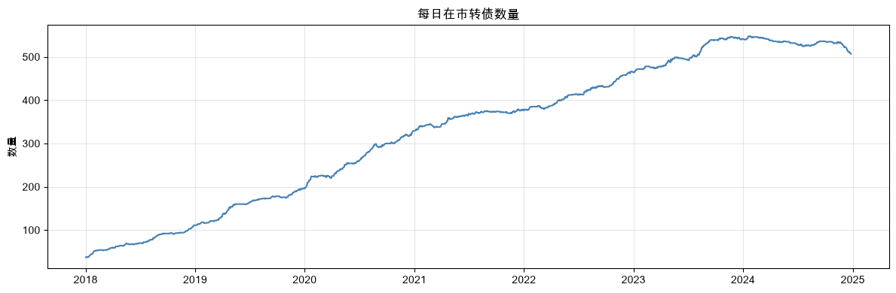
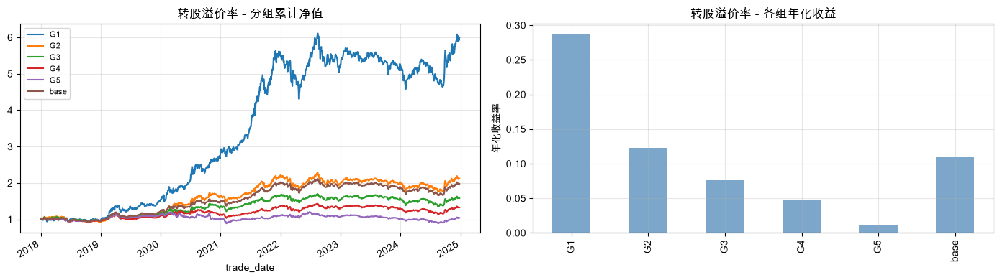
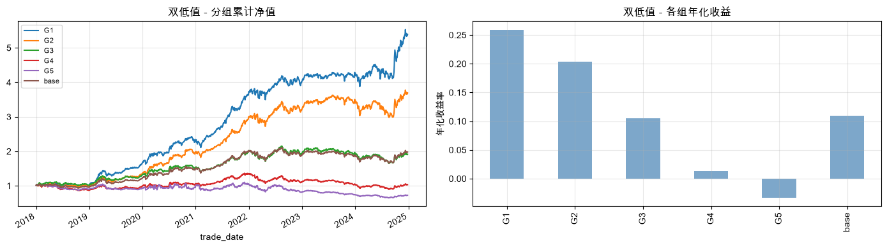
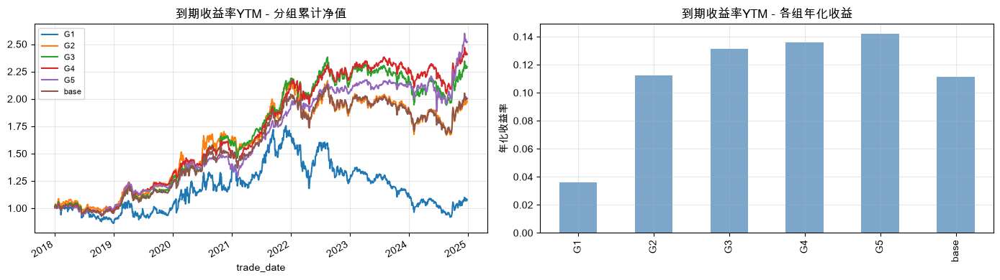
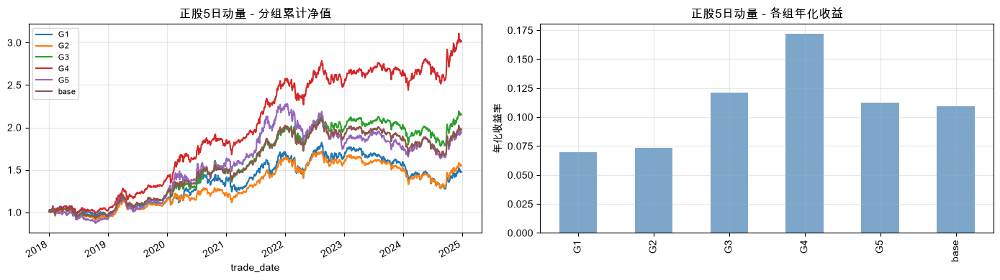
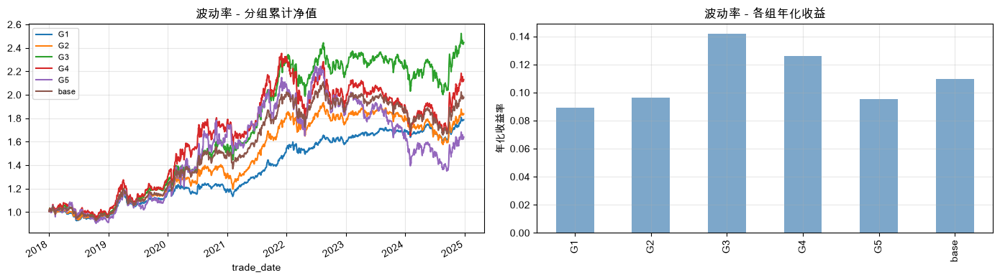
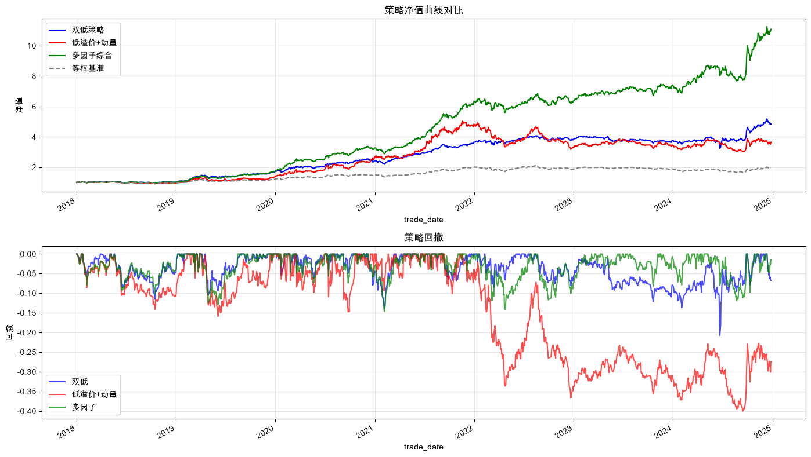
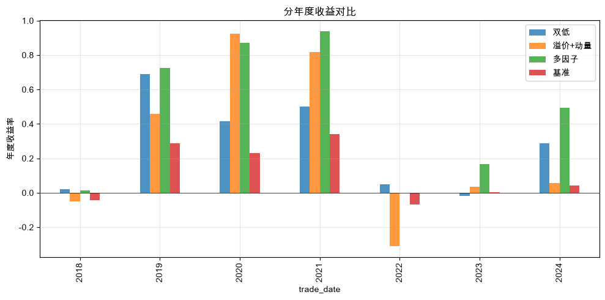

# 可转债多因子量化交易策略研究报告

> **数据说明**: 原始数据文件 `cb_data.pq` (182MB) 因体积过大未上传至仓库。Notebook 和 HTML 已包含全部运行输出，可直接查看结果，无需重新执行。

## 摘要

本报告基于2018年1月至2024年12月的可转债日频数据（873只转债），对多个量化因子进行了系统性分析，并构建了三种交易策略进行回测。研究发现双低因子和正股动量因子在可转债市场具有显著alpha，多因子综合策略在回测期内取得年化42.97%的收益率，夏普比率2.53。

## 一、研究背景

可转债兼具债券的下行保护和股票的上涨弹性，是量化策略的理想标的。相比股票市场：
- T+0交易，流动性好
- 免印花税，交易成本低
- 债底保护，极端下行有限
- 条款博弈提供额外alpha来源

## 二、数据概览

- 时间范围: 2018-01-02 ~ 2024-12-26
- 转债数量: 873只
- 数据频率: 日频
- 主要字段: 价格、转股溢价率、双低值、YTM、正股数据、波动率、换手率等78列

### 市场扩容趋势

市场在2019-2021年经历了转债扩容期，在市数量从约100只增长至400+只，为量化选债提供了足够的标的池。

## 三、因子分析

采用分组回测法（5分位数），每日按因子值排序分5组，等权持有，观察各组的累计收益差异。

### 3.1 转股溢价率(conv_prem)

**经济逻辑**: 转股溢价率衡量转债价格相对转股价值的溢价程度。低溢价率意味着转债与正股联动性强（股性），正股上涨时转债跟涨弹性大；高溢价率说明市场给予了过多的"保险费"，上涨时弹性不足。

**结论**: 低溢价组(G1)显著跑赢高溢价组(G5)，因子单调性良好。

### 3.2 双低值(dblow)

**经济逻辑**: 双低值 = 转债价格 + 转股溢价率×100。综合了低价格（债底保护，下行有限）和低溢价（股性强，上行弹性大）两个维度。是可转债市场最经典的选债指标。

**结论**: 低双低组(G1)长期大幅跑赢，且在各种市场环境下都相对稳健。

### 3.3 到期收益率(YTM)

**经济逻辑**: 到期收益率反映转债的债性强弱。高YTM意味着转债价格偏低，接近纯债价值，下行保护充分。但过高的YTM也可能意味着市场认为该转债缺乏转股机会。

**结论**: YTM因子更偏防御型，在熊市中高YTM组抗跌能力强。

### 3.4 正股5日动量(pct_chg_5_stk)

**经济逻辑**: 正股短期涨幅反映动量效应。在可转债市场，正股上涨→转股价值提升→转债跟涨，而且由于转债关注度较低，信息传导存在滞后。

**结论**: 高动量组(G5)短期收益显著更高，但波动也更大。

### 3.5 波动率(volatility)

**经济逻辑**: 转债内嵌看涨期权，波动率越高期权价值越大。但高波动同时意味着下行风险也大。

**结论**: 波动率因子的单调性不如前面几个因子明显。

### 3.6 因子分析小结

| 因子 | 经济逻辑 | 多头方向 | 有效性 |
|------|----------|----------|--------|
| 转股溢价率 | 低溢价=股性强，弹性大 | 做多低溢价(G1) | 强 |
| 双低值 | 低价格+低溢价，攻守兼备 | 做多低双低(G1) | 很强 |
| YTM | 高YTM=低价格，债底保护 | 做多高YTM(G5) | 中等(防御型) |
| 正股动量 | 动量效应，短期趋势延续 | 做多高动量(G5) | 强(但波动大) |
| 波动率 | 期权价值高 | 单调性弱 | 弱 |

## 四、策略构建与回测

基于因子分析结果，设计三种策略:

### 策略1: 双低策略
- 逻辑: 每日选取双低值最低的20只转债等权持有
- 优点: 简单、稳健、逻辑清晰

### 策略2: 低溢价+动量复合策略
- 逻辑: 先筛选溢价率最低的50%，再在其中按正股5日动量选top 20
- 优点: 在保证股性的前提下追趋势，弹性更大

### 策略3: 多因子综合策略
- 逻辑: 对双低排名(权重50%) + 动量排名(权重30%) + 换手率排名(权重20%)加权打分
- 优点: 多维度选债，风险更分散

### 策略净值与回撤

## 五、策略评估汇总

| 策略 | 累计收益 | 年化收益 | 年化波动 | 夏普比率 | 最大回撤 |
|------|----------|----------|----------|----------|----------|
| 双低策略 | 384.31% | 26.42% | 14.63% | 1.805 | -20.74% |
| 低溢价+动量 | 265.23% | 21.22% | 22.83% | 0.930 | -40.05% |
| 多因子综合 | 1008.76% | 42.97% | 16.98% | 2.531 | -14.64% |

### 分析
- **多因子综合策略**表现最优，年化43%、夏普2.53、最大回撤仅15%。通过多因子打分分散了单一因子的风险。
- **双低策略**是最稳健的选择，夏普1.8，逻辑最清晰，适合风险厌恶型投资者。
- **低溢价+动量**弹性最大但波动也最高，夏普仅0.93，动量因子的不稳定性拉低了风险调整后收益。

### 分年度表现

从分年度看，各策略在2020-2021年表现最佳（转债牛市），2022年均有回撤（市场系统性下跌），2023-2024年恢复。多因子综合策略在各年度的稳定性优于其他两种。

## 六、结论与局限

### 结论
1. 双低因子是可转债市场最有效且最稳定的alpha来源
2. 动量因子有短期增益，但需要与其他因子配合使用
3. 多因子综合打分能够有效提升策略的风险收益比
4. 加入换手率筛选有助于确保持仓的流动性

### 局限性
1. 未考虑交易成本（虽然转债交易成本较低，但日频调仓的摩擦成本仍需关注）
2. 调仓频率固定为日频，实际中周频或月频调仓可能更合理
3. 未过滤强赎风险转债（实际中需要排除即将强赎的标的）
4. 回测存在生存偏差（部分已退市转债可能未完整覆盖）

### 改进方向
1. 加入强赎预警过滤
2. 测试周频/月频调仓对收益和换手率的影响
3. 加入交易成本模拟（佣金+滑点）
4. 引入条款博弈因子（下修概率评估）
5. 动态因子权重调整（根据市场状态调整因子配比）
